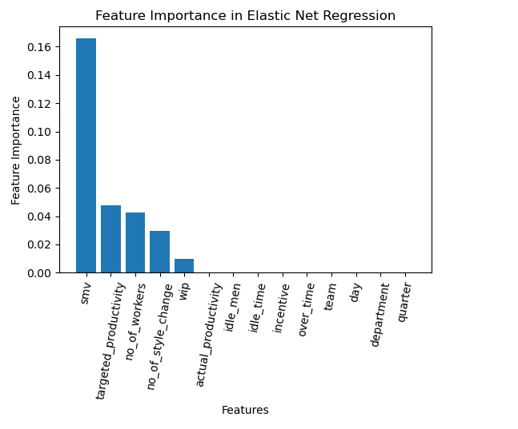

# Garment Productivity Prediction

## Project Overview
This project aims to predict employee productivity in the garment manufacturing industry using various machine learning models. By analyzing data related to employees' work such as time, incentives, and production rates, we develop predictive models that can aid in optimizing operational efficiency and strategic planning.

## Data
The dataset includes measurements like Standard Minute Value (SMV), Work in Progress (WIP), overtimes, incentives, and actual productivity among others. These features are crucial for understanding and predicting the productivity outcomes in garment production lines.

## Models Evaluated
Several machine learning models were evaluated in this project to find the most effective predictor of actual productivity:
- **Elastic Net Regression**: A linear regression model that combines L1 and L2 regularization to improve model performance and prevent overfitting.
- **Support Vector Regression (SVR)**: Utilizes a non-linear kernel to capture complex relationships in the data, providing robust predictions even in the presence of non-linear feature interactions.
- **K-Nearest Neighbors (KNN)**: A simple, instance-based learning algorithm that predicts outputs based on the majority vote of the k-nearest neighbors.
- **Random Forest**: An ensemble method that uses multiple decision trees to produce more accurate and stable predictions. Random Forest also provides insights into feature importance, highlighting the variables that most significantly impact productivity.

### Usage
Run the main script to execute the preprocessing, model training, and evaluation:

## Outputs
The analysis outputs are stored in the `output/` directory. Key outputs include:
- `output/model_performance_results.csv`: A CSV file containing the performance metrics of the evaluated models. [View the CSV file](output/model_performance_results.csv)
- `output/figures/feature_importance_histogram.png`: A histogram showing the importance of different features in the Elastic Net model. 
